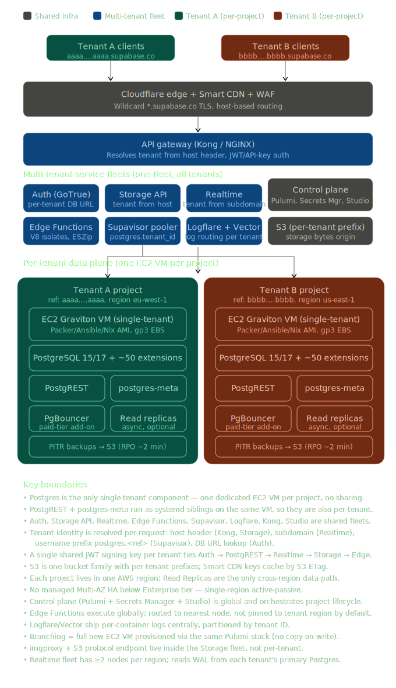

###### This `architecture` folder describes the existing architecture of the official supabase cloud. It does NOT represent the present or future architecture desired for this fork, it is just a starting point, a point of inspiration. 

##### [Click here to see the research on the Supabase Cloud Architecture](supabase_cloud_architecture_research.md)
##### [Click here to see the research draft on the potential Traffic One Architecture](supabase_cloud_architecture_research.md)

## Supabase Cloud Architecture Diagram

